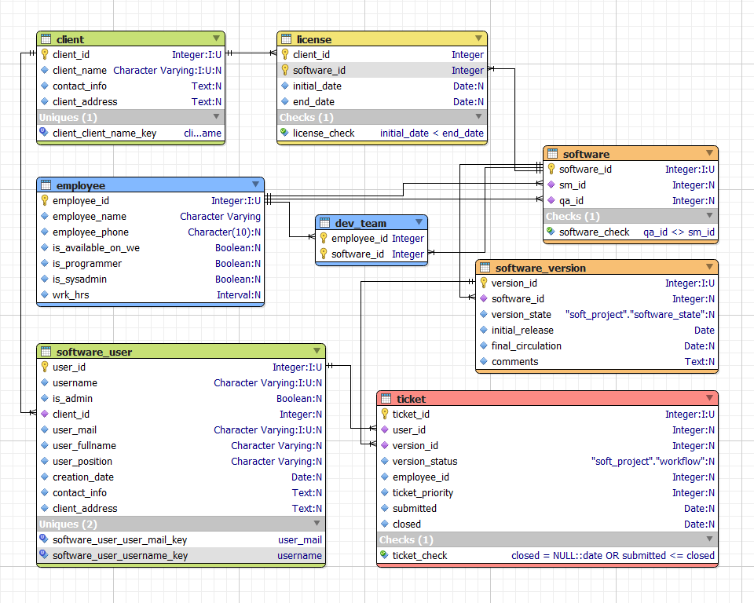

# Tables

## Employee

All the employees developing the software

* employee_id   -PK
* name,
* phone number

---

* (is prog)?
  * (prog) work hours
  * (prog) availability
* (is system administrator)?
* (join_date)
  * antiquity=now()-join_date,
* characteristics of his work devices (computer, monitor, etc.)

---

## Software

All kinds of software offered by the company with assigned ScrumMaster and QualityAssurance specialist (different employees)

* software_id        -PK
* (name)
* scrum master sm_id        - FK empl
* quality assurance qa_id   - FK empl
  * check that different from sm

*NULLable FKs!!*

## Dev_team

* fk_soft
* PK(emp,soft)

*How t perform programmers check? (a set of programmers -> dev table)
fk_employee??*

## Version

is assigned to a client, can be improved according to the demands, with new version being assigned to the company which issued the corresponding ticket, or updated for everybody in case of a bugfix

* version_id    - PK
* fk_Soft_id    - FK to Soft
* fk_employee_qa_works
* fk_employee_scrum_works
* version_state ENUM(
  * 'stable',
  * 'buggy',
  * 'improving')
* initial_release
* final_circulation
* comments
* actualization dates

## Client

Companies authorized to use SaaS according to the License

* id
* name,
* contact information,
* address,

## User

Client's employee using the SaaS, capable of issuing tickets concerning the specific software_version

* user_id        INT, autoincrement
* client_id        -FK
* Administrator role y/n
* Name
* creation
* position
* email

---

## _add a table user-version with checks to determine who can issue the tickets_

---

## Contract/Licence

* soft_id            FK: soft.soft_id
* client_id          FK: client.client_id
* initial_date        datetime
* final_date        datetime

## Ticket

* PK ticket_id    - INT, autoincrement        Ticket Number
* user_id    - FK user.user_id, NOT_NULL        User (reporter)
* version_id    - FK version.version_id, NOT_NULL    Version
* Status        - ENUM(
  * 'submitted',
  * 'scrum_accept',
  * 'dev_assigned',
  * 'scrum_reject',
  * 'dev_solved',
  * 'qa_approved',
  * 's cr_approved')
\- trigger: version_id++, (NB default version_state='stable')

---

* priority        SMALLINT or:
  * 'low',
  * 'medium',
  * 'high'

---

*\- if ticket submitted by a user(is_admin=true) then priority++*

\- if ticket belongs to version(version_state='buggy') then priority++

---

* employee_id        Developer
    \- constraint: only employee from specified software-version
* submission_date    datetime
* closure_date        datetime

---

?? For each ticket, the different states and the time spent on it by the development team are stored.

---

### CHECKS user-version (see above)

 *user_id* rights to issue ***<- PK ticket(ticket_id) ->*** to a specific *version_id* via:

-> PK software_user(user_id), FK software_user(client_id) -> PK client(client_id) <- PK(FK licence(client_id), FK licence(software_id)) -> PK software(software_id) <- FK software_version(software_id), PK software_version(version_id) <-

---

## Notes

*NULLable FKs in **soft** table, mind when referencing from **version***
