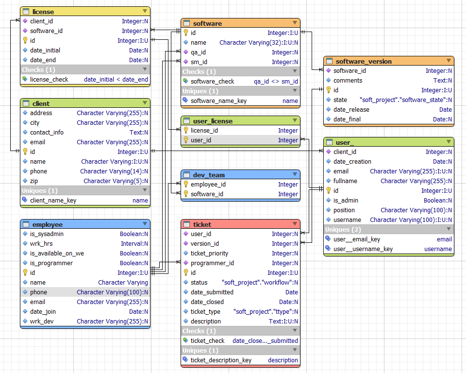

# LAB Project Report Ticketing Service Management for a Company

## Implementation

The database described below has been implemented in SQL for Postgres 12:
* [soft_project.sql](soft_project.sql) - schema and table definitions;
* [soft_project_user.sql](soft_project_data.sql) - user privileges and roles;
* [soft_project_data.sql](soft_project_data.sql) - test-data inserts;
* [soft_project_query.sql](soft_project_query.sql) - test-queries and updates, according to
* the original [assignment](assignment.md).

## Tools
Following tools and resources were used during project implementation:
- [Postgres 12](https://www.postgresql.org) - database engine
- [PgAdmin 4](https://www.pgadmin.org) - client for database tests
- [Docker](https://www.docker.com) and [Docker Compose](https://docs.docker.com/compose/) - virtual infrastructure
- [Valentina Studio](https://www.valentina-db.com/en/valentina-studio-overview) - modelling and ERD diagrams
- [Visual Studio Code](https://code.visualstudio.com), [PostgreSQL client for VSCode](https://marketplace.visualstudio.com/items?itemName=cweijan.vscode-postgresql-client2) - SQL implementation and database tests
- [DevDocs](https://devdocs.io/postgresql~12/) - PostgreSQL reference

## Copyright
2022 Vasilii Neganov, Grenoble

## Relational Model

### **Entities** and *relations*

We started from analyzing the business model.
The basic entities are **client**, a company *hiring* **users** who are *using* according to the contract (**license**) **software** which can *have* several **versions**, and is *serviced* by the **development team** which *consists* of **employees** on the basis of users' requests stated in **tickets**.

Similarly to the **dev_team** many-to-many relation employee--software, **user-license** table embodies the permissions of **users** in the framework of their companie's **licence** to *use* the specific **software** and to *issue* **tickets** thereupon. An additional table was implemented for this purpose.

Since "The new version of the software is updated for all the companies that have a current contract" the **software** was associated with the **client** company directly, whereas the current version is a foreign key determined when issuing the ticket.

Thus, seven tables for entities and two for many-to-many relations are required, which totals in nine.

### `Attributes`

Each Entity table (**client**, **software**, **version**, **employees**, **user**, and **ticket**) has self-incrementing integer `id` as a primary key (PK). **client**, **user**, and **software** have unique (U) `name` keys for better handling by human beings. Primary keys of many-to-many tables are the pairs of the corresponding foreign keys (FK).
Employees are assigned to software as an already mentioned **development team** whereas `scrum masters` or `quality assurance testers`, as there is only one of each per software, can be added as attributes to the **software**.

The **license** table have additional attributes characterizing the contracts -- the `dates` within which it is valid. All these considerations along with some checks and additional attributes can be clearly seen from the diagram.

TODO In the latest implementation (March 2022 and later), every client is using the latest **software version** with the maximum version id. New tickets are *assigned* to it with its state being triggered to `buggy` or `old` according to the `ticket_type` (`bug` or `feature`, respectively). After closing the ticket by the scrum master (`status='solved'`), the new version is created with the same `software_id`, `id` incremented and `state='stable'`.

## ERD

## Tables

### Employee

All the employees developing all the software provided by the company

* employee_id (PK)
* name
* phone
* is system administrator?

TODO
> if yes, this user is granted the highest privileges (cf. soft_project_users.sql)
* is prog?
  * (prog) work hours
  * (prog) availability
* (join_date) is added instead of antiquity,

to get `antiquity` one can query with

    antiquity=now()-join_date

FIXME

* characteristics of his work devices (computer, monitor, etc.)

### Software

All kinds of software offered by the company with two different employees assigned as ScrumMaster and QualityAssurance specialist (we consider it to be more efficient IRL, though it is not mentioned in the assignment)

* software_id (PK)
* name (U)
* scrum master sm_id (FK employee) 
* quality assurance qa_id (FK employee)
    `CHECK`

### Dev_team

employee--software relation

* fk_software_id
* fk_user_id
* the unique pair is (PK)

>*How to perform programmers check? (a set of programmers -> dev table)
fk_employee??*

### Version

is assigned to a client, can be improved according to the demands, with new version being assigned to the company which issued the corresponding ticket, or updated for everybody in case of a bugfix

* version_id (PK)
* software_id (FK software)
* quality assurance (qa), relation = works (FK employee)
* scrum master (sm), relation = works (FK employee)
* version_state (as a new TYPE, not via CHECK)
  * 'stable',
  * 'buggy',
  * 'old'

>is set to 'old' as soon as an improvement request is approved by sm

* initial_release
* final_circulation
* comments

### Client

Companies authorized to use SaaS according to the License

* id (PK)
* name (U)
* contact information
* address

### User

Client's employee using the SaaS, capable of issuing tickets concerning the specific software_version

* user_id (PK)
* username (U)
* Full Name
* email (U)
* client_id (FK client)
* position
* creation date
* Administrator role y/n

### User-Version

User--Software (version) relation
(software assigned to a company('s users) is not updated until a bugfix, new improved versions are released for those clients who request improvements. That is why versions used by different clients may be different--'stable' or 'old')

* version_id (FK software_version)
* user_id (FK user)
* the unique pair is (PK)

TODO
*functions to determine who can issue the tickets*

### Contract/Licence

* software_id (FK software)
* client_id (FK client)
* initial_date (default auto)
* final_date (default, on ticket closure is added by script =init. of new ver.)
* (software_id, client_id) PK

### Ticket

* ticket_id (PK)
* Reporter: user_id (FK user), NOT NULL
* version_id    - FK version.version_id, NOT_NULL    Version

TODO version check

* Status as a new TYPE
  * 'submitted',
  * 'scrum_accept',
  * 'dev_assigned',
  * 'scrum_reject',
  * 'dev_solved',
  * 'qa_approved',
  * 's cr_approved')

TODO trigger: version_id++, (NB default version_state='stable')

---

|Initial State|Target State|Comment|
| --- | --- | --- |
(initial)|submitted||
|submitted|scrum_accept scrum_reject||\
|scrum_accept|dev_assigned||
|dev_assigned|dev_solved||
|scrum_reject|(final)||
|dev_solved|qa_approved dev_assigned||
|qa_approved|scr_approved dev_assigned||
|scr_approved|(final)||

TODO scr_approved should trigger:

    INSERT INTO software_version (id, software_id, state, initial_release, final_circulation)
    VALUES
    (<soft_id>, <last_version_id>++), 'stable', now(), NULL)

and also modify the last version entry like this:

    UPDATE software_version 
    SET final_circulation=now()
    WHERE id=<last_version_id>

and also modify the user_version entries like this:

    UPDATE user_version 
    SET version_id=<new_version_id>
    WHERE version_id=<last_version_id> AND user=
---

* priority SMALLINT `CHECK priority IN (0-2)` or CHAR value if queried:
  * 'low',
  * 'medium',
  * 'high'

---

    if ticket submitted by a user(is_admin=true) then priority++
    if ticket belongs to version(version_state='buggy') then priority++

* employee_id

TODO
-- CHECK employee(is_programmer='true')

    constraint: only employee from specified software dev_team (neither aq nor sm, preferably)

* submission date    datetime
* closure date        datetime

---

TODO

    ?? For each ticket, the different states and the time spent on it by the development team are stored.
---

### Notes
